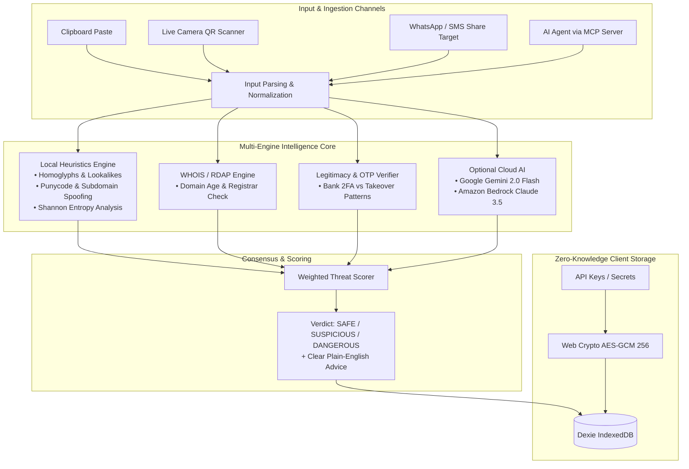

# IsItLegit — AI-Powered Scam, Phishing & Legitimacy Intelligence Engine 🛡️

[](https://aws.amazon.com/amplify/)
[](https://react.dev/)
[](https://www.typescriptlang.org/)
[](https://tailwindcss.com/)
[](https://web.dev/progressive-web-apps/)
[](https://modelcontextprotocol.io/)
[](https://www.wemakedevs.org/aws/first-commit)

> **Inspect suspicious links, WhatsApp texts, and emails without clicking them. Distinguish genuine 2FA OTP codes and bank fraud alerts from malicious scams with 100% zero-knowledge client-side privacy.**

---

## 🌟 Overview

Every day, millions of people receive urgent SMS messages, WhatsApp forwards, suspicious courier alerts, and QR codes. When users receive a real bank fraud alert or a 2FA OTP code, they often panic and call fake numbers; when they receive a phishing link, they accidentally click it.

**IsItLegit** is an open-source cybersecurity platform and Progressive Web App built for the **Bharat Builds Tour: First Commit Hackathon (WeMakeDevs & AWS)**. It features:
- **Non-Clicking Inspection**: Safely analyze URLs, messages, and emails without opening them in your browser.
- **Authenticity & Legitimacy Verification**: Confirms genuine security alerts and bank 2FA OTPs, explaining *why* they looked alarming versus *why* they are legitimate.
- **Computer Vision QR Code Scanner**: Live real-time camera scanning powered by `jsQR` with an animated cyber reticle HUD.
- **Zero-Config Offline Intelligence**: Runs homoglyph attack detection, RDAP domain registration age heuristics, brand impersonation scans, and Shannon entropy analysis completely in-browser with zero cost or API keys.
- **100% Hardware Privacy**: Zero server logging and zero remote telemetry. Credentials are encrypted locally using **AES-GCM 256-bit** with PBKDF2 keys via the browser's Web Crypto API.
- **Model Context Protocol (MCP) Server**: Allows AI agents (Claude Desktop, Cursor, Antigravity) to directly call threat analysis tools.
- **Progressive Web App (PWA)**: Installable on Android, iOS, and Desktop with offline caching and native **Web Share Target** (share suspicious links directly from WhatsApp/Telegram).

---

## 🏗️ Architecture



---

## 🚀 Key Features

### 1. 🛡️ Legitimacy & Authentic Alert Classifier
Unlike conventional blacklists that only flag malicious links, **IsItLegit** recognizes legitimate transactional alerts (e.g. Chase, Bank of America, PayPal, SBI, HDFC):
- Explains why the message was triggered.
- Confirms whether the link belongs to an officially verified root domain.
- Reminds the user never to share one-time passcodes over the phone.

### 2. 📷 Live Camera QR Scanner
- In-browser computer vision using `jsQR` running at 30 fps.
- Cybernetic scanner reticle HUD with targeting guides and instant decode sound/haptics.
- Inspects QR code payloads before any browser navigation can occur.

### 3. 📱 Progressive Web App (PWA) with Web Share Target
- **Instant Installation**: Add to home screen on iOS, Android, and Desktop Chrome/Edge.
- **Share Directly from Messaging Apps**: Tap "Share" on any suspicious text or link inside WhatsApp, Telegram, or SMS, and select **IsItLegit** to analyze it instantly.
- **Full Offline Operation**: Service Worker caches all critical threat databases and local heuristics for use without internet.

### 4. 🤖 Model Context Protocol (MCP) Server
Integrated MCP server exposes threat intelligence tools over standard I/O (stdio):
- `check_url`: Inspects links for brand spoofing, Cyrillic lookalikes, and dangerous TLDs.
- `check_message`: Scans messages for social engineering, artificial urgency, and financial scams.
- `verify_authenticity`: Confirms whether an unexpected 2FA OTP code or security notification is genuine.

---

## ⚡ Quick Start (Local Development)

### Prerequisites
- [Node.js](https://nodejs.org/) v18 or higher (v20+ recommended)
- `npm`

### Installation
```bash
# Clone the repository
git clone https://github.com/sachinn-alt/isitlegit.git
cd isitlegit

# Install dependencies
npm install

# Start development server
npm run dev
```

Open [http://localhost:5173](http://localhost:5173) in your browser.

---

## 🧪 Testing & Verification

IsItLegit includes comprehensive unit test suites covering URL normalization, homoglyph detection, email MIME parsing, and threat scoring algorithms:

```bash
# Run unit test suite (10/10 automated tests)
npm test

# Build production bundle
npm run build
```

---

## 🔌 Using the MCP Server with Claude Desktop

The MCP server is located at `mcp/server.js`. To connect it to **Claude Desktop**, add this snippet to your Claude Desktop configuration file:

**Windows**: `%APPDATA%\Claude\claude_desktop_config.json`  
**macOS**: `~/Library/Application Support/Claude/claude_desktop_config.json`

```json
{
  "mcpServers": {
    "isitlegit": {
      "command": "node",
      "args": [
        "C:\\Users\\DELL\\.gemini\\antigravity-ide\\scratch\\isitlegit\\mcp\\server.js"
      ]
    }
  }
}
```

Now Claude can use `check_url`, `check_message`, and `verify_authenticity` natively!

---

## ☁️ Deploying to AWS Amplify Hosting (100% Free Tier)

This repository includes a pre-configured [`amplify.yml`](amplify.yml) file designed for automated zero-config deployment on AWS:

1. Log in to the [AWS Management Console](https://console.aws.amazon.com/amplify/).
2. Navigate to **AWS Amplify** → Click **"Host web app"**.
3. Select **GitHub** as the source repository and authorize AWS.
4. Select the repository **`sachinn-alt/isitlegit`** and branch **`main`**.
5. Amplify will auto-detect `amplify.yml`. Click **"Save and deploy"**.
6. Within 2 minutes, your live production app will be accessible with a free SSL certificate on `https://main.xxxx.amplifyapp.com`!

---

## 🔒 Security & Privacy Architecture

- **No Remote Telemetry**: Zero analytics trackers, zero logging pixels, and zero server-side storage.
- **Hardware-Encrypted Keyring**: Any optional API keys (Gemini, VirusTotal, AWS) provided by the user are encrypted locally using AES-GCM 256-bit with PBKDF2 key derivation (100,000 iterations) directly in the browser's IndexedDB.
- **Safe Sandboxing**: URLs submitted for inspection are never pinged or fetched directly without user consent, preventing drive-by malware downloads or read receipts.

---

## 🏆 Hackathon Alignment

Built for the **Bharat Builds Tour: First Commit Hackathon**:
- **"Ship It" Track**: Production-ready, fully responsive PWA with offline caching, camera QR scanning, and automated AWS Amplify continuous deployment.
- **"Best UI" Track**: Ultra-modern cybernetic visual design utilizing Aceternity UI, ReactBits animations, smooth glassmorphism, dynamic progress indicators, and accessible dark-first styling.

---

## 📄 License

MIT License — free for personal, educational, and open-source use.
